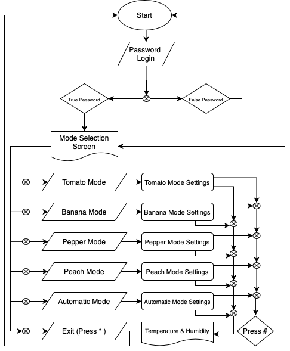
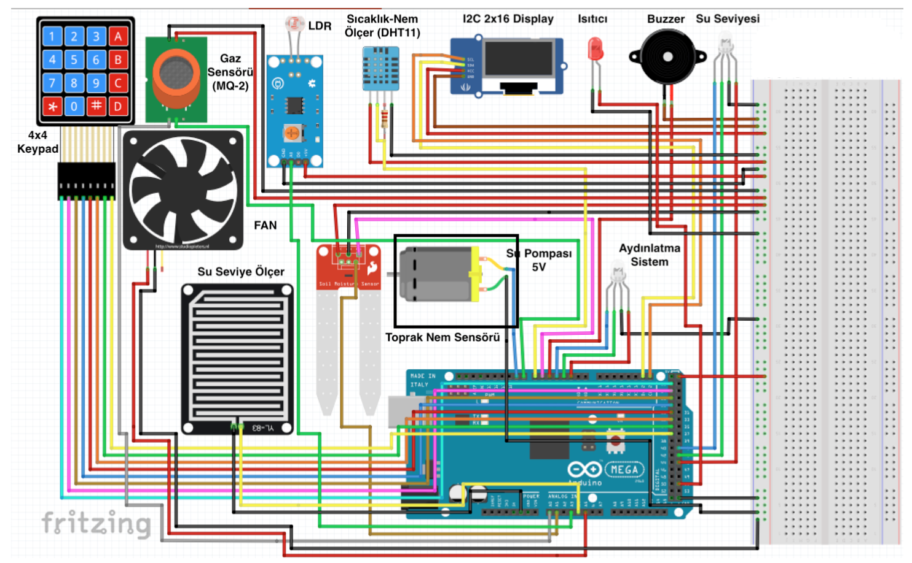

# Greenhouse Automation with Arduino
Serada meydana gelebilecek bir aksaklıktan ötürü sulama veya ışıklandırma yapılamadığından dolayı bu tür otomasyonlar sayesinde bu sisteme gömülü bitkilere bağlı bilgiler doğrultusunda sistem optimum şekilde çalışmakta ve bitkimiz sıkıntısız şekilde büyümektedir. Sistemde yer alan sulama sistemi, suyun çekildiği su deposundan RGB Led sayesinde bilgi alabilir ve su deposu durumunu görebilir.Bu verimliliğin yanında insan gücünü azaltarak kulanıcıya minimum harcama ile sera yetiştiriciliği yaptırılmaktadır.

# Libraries
1. [Liquid Crystal I2C](https://www.arduinolibraries.info/libraries/liquid-crystal-i2-c)
2. [DHT11](https://www.arduinolibraries.info/libraries/dht-sensor-library)
3. [KeyPad](https://www.arduinolibraries.info/libraries/keypad)

# Algorithm

# Pins

# Circuit

